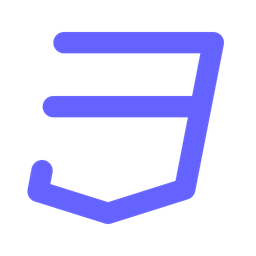
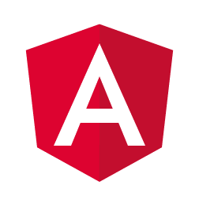
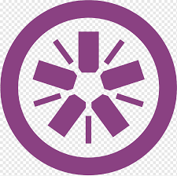
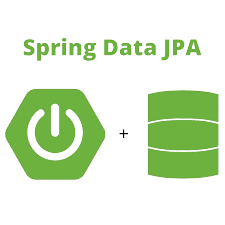
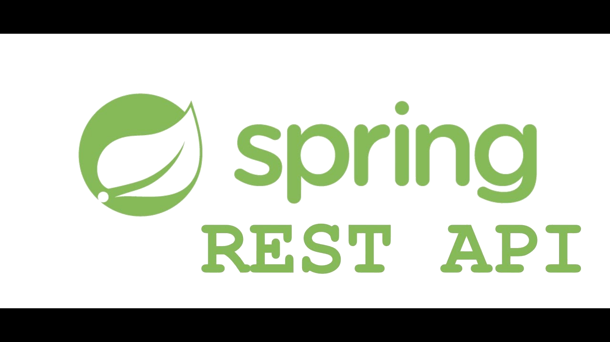
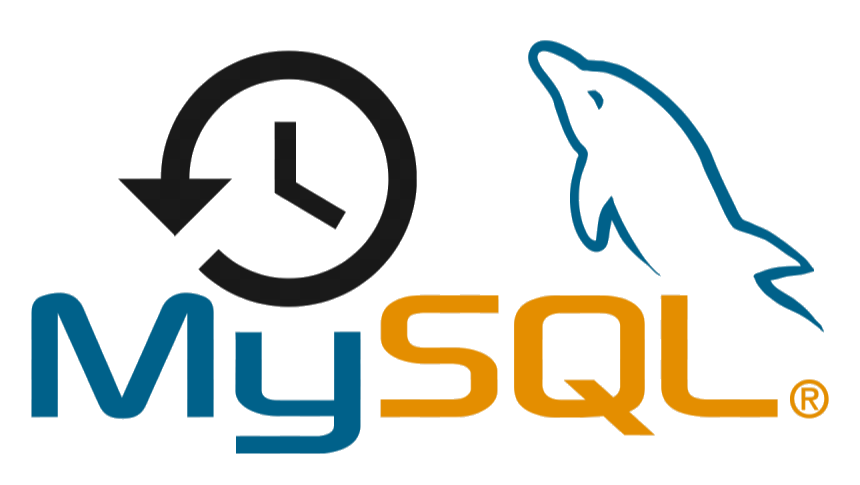
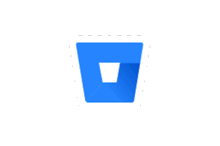
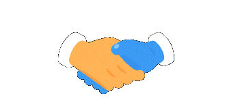

<!--
<!-- Main Gif -->
<!--  -->

<!-- Salutation -->

<!-- ### &nbsp;&nbsp;**Hello World**&nbsp;&nbsp; -->

<!-- <br>
<!-- Introduction
<p>
  <em>I'm <strong>Manu Mathew</strong></em>&nbsp;&nbsp;
</p> -->

<!-- About Me Section starts -->

<!-- ### **` About Me`** 🚀 -->

<!-- <p><em>&nbsp;&nbsp;I’m a <strong>Front-end developer</strong>&nbsp;with&nbsp;<strong> B.E.</strong>&nbsp;in&nbsp;<strong>Computer Science And Engineering</strong> from Visvesvaraya Technological University, Bangalore. </em></p> -->

<!-- <p><em>&nbsp;&nbsp;I am passionate about Web Dev & I enjoy learning new technologies. </em></p></br> -->

<!-- - 🔲 Passionate Thinker | Competitive Programmer: [HackerRank- @manumathew](https://www.hackerrank.com/manu1997)
- 🔭 I love connecting the dots: be it ideas from different disciplines, people from different teams, or applications from different industries.
- 👯 I’m looking to collaborate on creating wonderful projects.
- 💬 Ask me about flask framework, SQLAlchemy, tailwind or any tech related stuffs.  -->

<!-- About Me Section ends -->

<!-- My Experiences Section starts
### **` My Experiences`** 🚀
- [Systems Engineer (Tata Consultancy Services)](https://www.tcs.com/) - (Nov'22 - present)
- [Assistant Systems Engineer (Tata Consultancy Services)](https://www.tcs.com/) - (Nov'21 - Nov'22)
- [Assistant Systems Engineer -Trainee (Tata Consultancy Services)](https://www.tcs.com/) - (Nov'20 - Nov'21)

 My Experiences Section ends

 Proficient in Section starts

### **`Proficient in:`** 🚀

**`- Front-end technologies`**
<br>
&nbsp;&nbsp;&nbsp;&nbsp;&nbsp;
<br>

**`- Back-end technologies`**
<br>
&nbsp;&nbsp;&nbsp;&nbsp;&nbsp;&nbsp;&nbsp;
<br>

**`- Database`**
<br>
&nbsp;&nbsp;&nbsp;
<br>

**`- Version Control System`**
<br>
&nbsp;&nbsp;

<details>
 <summary>My GitHub stats&nbsp;</summary>
 <p align = "center">
  
 </p>
</details>
<details>
 <summary>Language Stats&nbsp;</summary>
 <p align = "center">
  
 </p>
</details>
<details>
 <summary>Wakatime Stats&nbsp;</summary>
 <p align = "center">
  
 </p>
</details>
<details>
 <summary>Github Streak&nbsp;</summary>

  [](https://git.io/streak-stats)

</details>
<hr> -->

<!-- Social Section -->
<!-- <p align="center">
  <i>Take a look at my repositories and let's get in touch!</i>

<p align="center">
  <a href= "https://github.com/Augustine97">
    
  </a>
  <a href= "https://www.linkedin.com/in/i-am-manumathew/">
    
  </a>
 <a href="https://www.hackerrank.com/manu1997">
   
  </a> -->
 <!--  <a href= "https://twitter.com/tallguyjenks">
    
  </a>
  <a href= "https://www.bryanjenks.dev">
    
  </a>
  <a href="https://www.buymeacoffee.com/tallguyjenks">
    
  </a>
  <a href="https://www.youtube.com/c/BryanJenksTech?sub_confirmation=1">
    
  </a>
  <a href="https://orcid.org/0000-0002-9604-3069">
    
  </a>
  <a href="https://github.com/tallguyjenks/CV/blob/master/CV.pdf">
    
  </a>
  <a href="mailto:bryan@bryanjenks.dev">
    
  </a>
  <a href="https://medium.com/@tallguyjenks">
    
  </a>
  <a href="https://stackoverflow.com/users/12339658/tallguyjenks">
    
  </a> -->
<!-- </p> -->

<!--  -->

# Manu Mathew

Greetings!  I'm Manu Mathew. I am passionate about Web Development and I enjoy learning new technologies.

## Highlights:

🚀 I am currently pursuing P.G in Computer Applications Development, at Conestoga College, Waterloo, Canada.

🚀 I was working as a Front-end engineer at Tata Consultancy Services ( Nov 2020- Feb 2024 ), Bangalore and I have three years working in UI technologies like REACT.

<!--  -->


<!--  -->

<!--START_SECTION:waka-->

```rust
From: 05 November 2023 - To: 22 February 2025

Total Time: 604 hrs 31 mins

JavaScript        166 hrs 18 mins >>>>>>-------------------   25.06 %
TypeScript        132 hrs 5 mins  >>>>>--------------------   19.90 %
EJS               68 hrs 33 mins  >>>----------------------   10.33 %
C#                61 hrs 18 mins  >>-----------------------   09.24 %
Other             59 hrs 10 mins  >>-----------------------   08.92 %
```

<!--END_SECTION:waka-->
